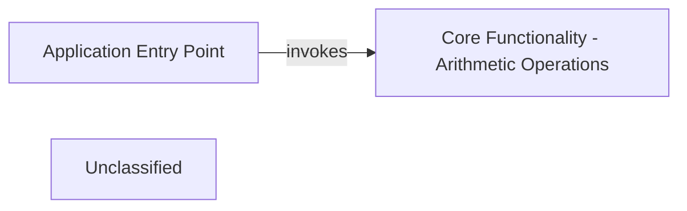

## Details

The `testcodeboarding` project is structured around a central `Application Entry Point` responsible for initiating and coordinating the application's flow. This entry point, defined in `app.py`, interacts directly with the `Core Functionality - Arithmetic Operations` component, which encapsulates fundamental arithmetic logic in `func.py`. The `Application Entry Point` leverages the arithmetic operations provided by `Core Functionality` to perform calculations, demonstrating a clear separation of concerns where the main application logic orchestrates calls to a dedicated set of functional utilities. This architecture facilitates maintainability and modularity, allowing for independent development and testing of core functionalities.

### Application Entry Point
Serves as the primary entry point and orchestrator for the application, defining the high-level sequence of actions.

**Related Classes/Methods**:

- <a href="https://github.com/workingshem/testcodeboarding/blob/mainapp.py#L3-L6" target="_blank" rel="noopener noreferrer">`app.main`:3-6</a>

### Core Functionality - Arithmetic Operations
Encapsulates fundamental, reusable business logic related to arithmetic calculations.

**Related Classes/Methods**:

- <a href="https://github.com/workingshem/testcodeboarding/blob/mainfunc.py#L1-L2" target="_blank" rel="noopener noreferrer">`func.add`:1-2</a>

### Unclassified
Component for all unclassified files and utility functions (Utility functions/External Libraries/Dependencies)

**Related Classes/Methods**: _None_

### [FAQ](https://github.com/CodeBoarding/GeneratedOnBoardings/tree/main?tab=readme-ov-file#faq)