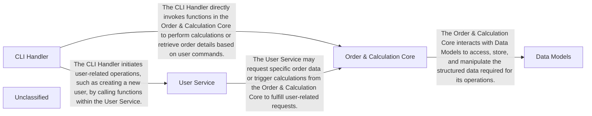

## Details

The application follows a clear service-oriented architecture, centered around a CLI Handler that serves as the primary interface for user interaction. This handler orchestrates calls to the User Service for managing user-related operations, such as creation and retrieval, and the Order & Calculation Core for handling order processing and financial calculations. Both services rely on the Data Models component, which defines the core data structures (User, Order) ensuring consistent data representation across the application. This design promotes modularity, allowing for independent development and maintenance of each component while maintaining clear interaction pathways for data flow and functional execution.

### CLI Handler
The application's primary entry point, responsible for parsing command-line arguments, dispatching commands, and orchestrating the overall application flow based on user input.

**Related Classes/Methods**:

- <a href="https://github.com/workingshem/testcodeboarding/blob/mainapp.py#L6-L28" target="_blank" rel="noopener noreferrer">`app.main`:6-28</a>

### User Service
Encapsulates all business logic related to user management, including the creation and handling of user data.

**Related Classes/Methods**:

- <a href="https://github.com/workingshem/testcodeboarding/blob/mainservices.py#L5-L18" target="_blank" rel="noopener noreferrer">`services.UserService`:5-18</a>
- <a href="https://github.com/workingshem/testcodeboarding/blob/mainservices.py#L11-L15" target="_blank" rel="noopener noreferrer">`services.UserService.create_user`:11-15</a>

### Order & Calculation Core
Manages the core business logic for performing arithmetic calculations on user orders and retrieving specific order data.

**Related Classes/Methods**:

- <a href="https://github.com/workingshem/testcodeboarding/blob/mainservices.py#L36-L38" target="_blank" rel="noopener noreferrer">`services.OrderService.calculate_user_total`:36-38</a>
- <a href="https://github.com/workingshem/testcodeboarding/blob/mainservices.py#L33-L34" target="_blank" rel="noopener noreferrer">`services.OrderService.get_orders_by_user`:33-34</a>

### Data Models
Defines the fundamental data structures and models used consistently across the application, ensuring data integrity and a clear representation of information.

**Related Classes/Methods**:

- <a href="https://github.com/workingshem/testcodeboarding/blob/mainmodel.py" target="_blank" rel="noopener noreferrer">`models.User`</a>
- <a href="https://github.com/workingshem/testcodeboarding/blob/mainmodel.py" target="_blank" rel="noopener noreferrer">`models.Order`</a>

### Unclassified
Component for all unclassified files and utility functions (Utility functions/External Libraries/Dependencies)

**Related Classes/Methods**: _None_

### [FAQ](https://github.com/CodeBoarding/GeneratedOnBoardings/tree/main?tab=readme-ov-file#faq)