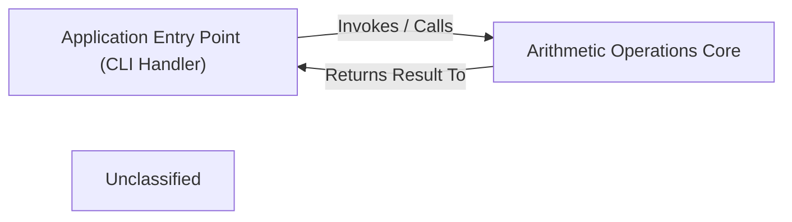

## Details

This project implements a simple arithmetic application with a clear two-component architecture. The Application Entry Point (CLI Handler) serves as the primary control module, initiating execution and directing operations. It delegates core arithmetic tasks to the Arithmetic Operations Core, which provides fundamental mathematical functions like addition and multiplication. This design promotes modularity, allowing for independent development and testing of the application's control flow and its core computational logic.

### Application Entry Point (CLI Handler)
Manages command-line input, initializes the application, and orchestrates calls to the core arithmetic functionalities. It is the primary control component.

**Related Classes/Methods**:

- `app.main`:3-6

### Arithmetic Operations Core
Provides the fundamental arithmetic operations (e.g., addition, multiplication) that constitute the core business logic of the application.

**Related Classes/Methods**:

- `func.add`:1-2
- `func.mul`:4-5

### Unclassified
Component for all unclassified files and utility functions (Utility functions/External Libraries/Dependencies)

**Related Classes/Methods**: _None_

### [FAQ](https://github.com/CodeBoarding/GeneratedOnBoardings/tree/main?tab=readme-ov-file#faq)