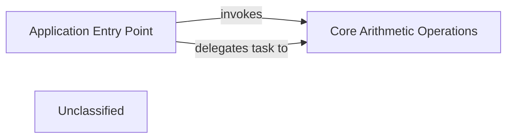

## Details

The `testcodeboarding` project is structured around a clear separation of concerns, with an `Application Entry Point` module (`app.py`) responsible for initiating the application's execution. This entry point orchestrates calls to the `Core Arithmetic Operations` module (`func.py`), which encapsulates the fundamental business logic for performing arithmetic calculations. The `main` function within `app.py` serves as the primary control flow mechanism, invoking arithmetic functions like `add` and `mul` from `func.py` to perform its tasks. This design promotes modularity and maintainability, allowing for independent development and testing of core functionalities. The data flow is straightforward: the `Application Entry Point` calls functions within `Core Arithmetic Operations`, which then return results back to the entry point for further processing or display.

### Application Entry Point
The primary orchestrator of the CLI tool, responsible for initiating the application and directing control flow.

**Related Classes/Methods**:

- <a href="https://github.com/workingshem/testcodeboarding/blob/mainapp.py#L3-L6" target="_blank" rel="noopener noreferrer">`main`:3-6</a>

### Core Arithmetic Operations
Encapsulates the fundamental business logic for performing arithmetic calculations.

**Related Classes/Methods**:

- <a href="https://github.com/workingshem/testcodeboarding/blob/mainfunc.py#L1-L2" target="_blank" rel="noopener noreferrer">`add`:1-2</a>

### Unclassified
Component for all unclassified files and utility functions (Utility functions/External Libraries/Dependencies)

**Related Classes/Methods**: _None_

### [FAQ](https://github.com/CodeBoarding/GeneratedOnBoardings/tree/main?tab=readme-ov-file#faq)